# PTSNSU Online Deep Route Map

Generated: 2026-07-04

Scope: public portal, admission portal, public grievance portal, `/Univ/` university back office, and `/College/` FC/college area. Crawl was read-only. I did not submit operational forms, upload files, assign complaints, generate lists, issue refunds, edit users, change passwords, or open individual private student records beyond identifying route structure.

## 1. System Levels

The site is organized into these levels:

1. Public UiMS portal: student login, results, new UiMS account, forgot password, instruction PDF.
2. Public admission portal: applicant login, registration, Ph.D. registration, private registration, admission notices/guidelines.
3. Public grievance portal: complaint registration/search.
4. University administrator portal: `/Univ/`, full ERP back office.
5. College / FC portal: `/College/`, facilitation-center workflows for exam/admission/marks.
6. Shared control/report handlers: `/Control/*`, used for downloads/prints.

## 2. Linkage Overview

```mermaid
flowchart TD
  Public["Public Portal /"] --> Results["Results /results.aspx"]
  Public --> UiMSNew["New UiMS Account /UserNew.aspx"]
  Public --> Forgot["Forgot Password /FgPWD.aspx"]
  Public --> Admission["Admission Portal /admission/"]
  Public --> GrievancePublic["Grievance Portal /uims/Grievance/"]
  Public --> Univ["University Back Office /Univ/"]

  Admission --> AdmissionDecl["Regular Admission Declaration /admission/decl.aspx"]
  Admission --> PhDReg["Ph.D. Registration /admission/RegPHD.aspx"]
  Admission --> PvtReg["Private Admission /admission/registerPvtUG.aspx"]
  Admission --> AdmissionForgot["Admission Forget Password /admission/ForgetPass.aspx"]
  Admission --> Seat404["Seat Availability /admission/seats.aspx (404 during crawl)"]

  Univ --> PreAdm["Pre Admission"]
  Univ --> PostAdm["Post Admission"]
  Univ --> Enroll["Enrollment"]
  Univ --> Acad["Academic"]
  Univ --> Exam["Examination"]
  Univ --> Emarks["Results / Emarks"]
  Univ --> Fees["Fees / RFT"]
  Univ --> Degree["Degree"]
  Univ --> GrievanceAdmin["Grievance Manager"]
  Univ --> Notices["Notice Board"]
  Univ --> SysAdmin["Users / Roles"]
  Univ --> College["College / FC /College/"]

  College --> CollegeExam["Exam Form"]
  College --> CollegeMarks["Marks Upload"]
  College --> CollegeAdm["Private Admission Verification"]

  Fees --> ControlDownload["/Control/Download.aspx"]
  Fees --> RftPrint["/Control/RftPrint.aspx"]
```

## 3. Public UiMS Portal

| Route | What It Does | Inputs / Actions | Links Out |
|---|---|---|---|
| `/` and `/default.aspx` | Main public page, notice board, UiMS login | username/enrollment, password, CAPTCHA, Login | Results, Admission Portal, Grievance Portal, University Website, Forgot Password, New UiMS Account, instruction PDF |
| `/results.aspx` | Public result lookup and published-results list | enrollment number, roll number, `Search Your Result` | Search Again/Home |
| `/UserNew.aspx` | New student UiMS registration | enrollment number, DOB day/month/year, `Search Enrollment No.` | Main public nav |
| `/FgPWD.aspx` | UiMS password recovery | username/enrollment, CAPTCHA, `Send Your Password` | Main public nav |
| `/UiMSInstruction.pdf` | New UiMS registration guide | PDF | Linked from login page |

Observed results page structure:

- Published-result table columns: `Sr. No.`, `Year`, `Course Name`, `Sem/Year`, `Exam Month`, `Pub. Date`, `RV/RT. Date`, `Remarks`.
- Result lookup table columns: `RESULT AVAILABLE`, `Sr. No.`, `Year`, `Course`, `Sem/Year`, `Roll Number`, `Exam Type`, `Date`, `Marksheet`.

## 4. Public Admission Portal

| Route | What It Does | Inputs / Actions | Links Out |
|---|---|---|---|
| `/admission/` | Applicant portal home, notices, merit-list links, applicant login | registration no., password, CAPTCHA, Login | guidelines PDFs, registration flows, forgot password |
| `/admission/default.aspx` | Admission home alias | same area as admission home | Home |
| `/admission/decl.aspx` | Declaration page before regular registration | terms checkbox, `Proceed` | regular registration continuation |
| `/admission/RegPHD.aspx` | Ph.D. entrance/admission registration | name, father name, mobile, email, `Send OTP` | OTP-driven registration |
| `/admission/registerPvtUG.aspx` | Private admission registration | course, college, name, father name, mobile, email, `Send OTP` | OTP-driven registration |
| `/admission/ForgetPass.aspx` | Admission password recovery | form no., mobile no., CAPTCHA, `Send` | applicant login |
| `/admission/seats.aspx` | Seat availability | returned 404 during crawl | linked from admission home |

API-like endpoint observed:

- `default.aspx/VerifyCaptcha`
  - Referenced by `/admission/` and `/uims/Grievance/`.
  - Called through jQuery `POST`.
  - Content type: `application/json; charset=utf-8`.
- `ForgetPass.aspx/VerifyCaptcha`
  - Referenced by `/admission/ForgetPass.aspx`.
  - Same WebForms static-method style.

## 5. Public Grievance Portal

| Route | What It Does | Inputs / Actions |
|---|---|---|
| `/uims/Grievance/` | Public grievance registration and complaint search | category, enrollment no., roll no., name, father name, mobile, file upload, complaint text, CAPTCHA/reCAPTCHA, `Search Your Complaint`, `Register Your Complaint` |

This page links into the university complaint manager after complaints are submitted and assigned internally, but the public page itself is a standalone form.

## 6. University Back Office: `/Univ/`

Both supplied accounts reached this level:

- `admin`: displayed as `Administrator(admin)`.
- `brc`: displayed as `BR Computers(brc)`.

I found the same visible route set and actions for both accounts.

### 6.1 University Home

| Route | What It Does | Inputs / Actions | Linked Modules |
|---|---|---|---|
| `/Univ/` | Main back-office dashboard | search by enrollment/roll, search by registration/application no. | all `/Univ/*` modules |
| `/Univ/default.aspx` | Same dashboard route | same as above | all `/Univ/*` modules |

Dashboard also shows an open-grievances alert linking to `/Univ/Grievance/`.

### 6.2 Pre Admission 2026

| Route | Purpose | Inputs / Actions | Tables / Outputs | Child Links |
|---|---|---|---|---|
| `/Univ/PreAdm/default.aspx` | Pre-admission dashboard | session/course/status filters, `Apply Filter`, `Download Excel` | session/course summary with Pending, Verified, Document Deficiency, Rejected, Male/Female/Total | filtered application lists |
| `/Univ/PreAdm/FrmList.aspx` | Regular form verification | session, course, status, application/search filters, `Search Candidate`, `Download Excel` | candidate list after search/filter | form view/verification pages |
| `/Univ/PreAdm/PhdFrmList.aspx` | Ph.D. form verification | Ph.D.-specific filters, `Search Candidate`, `Download Excel` | candidate list after search/filter | Ph.D. verification pages |
| `/Univ/PreAdm/MeritList.aspx` | Merit list generation | session/course/round/category-style filters, `Generate List` | generated merit list | post-admission/admission list flows |
| `/Univ/PreAdm/VeriUsers.aspx` | Verification-user management | user fields, course assignment, `Update`, `Download Excel` | table: Name, Faculty/Dept, Email, Mobile, Courses, ID | edit user rows |
| `/Univ/PreAdm/sessions.aspx` | Academic/admission session setup | session name/status fields, `New Session`, `Submit` | table: Session Name, Status, Edit, ID | edit session rows |

### 6.3 Post Admission 2026

| Route | Purpose | Inputs / Actions | Tables / Outputs | Child Links |
|---|---|---|---|---|
| `/Univ/PostAdm/default.aspx` | Post-admission dashboard | session/course/status filters, `Apply Filter`, `Download Excel` | Pending, Admitted Fees Paid, gender counts, admission-list links | `/Univ/PostAdm/AdmList.aspx?...` filtered report URLs |
| `/Univ/PostAdm/AdmList.aspx` | Admission list report | session/round/course/category and report filters, `Generate Report` | admission list after generation | profile/view routes |
| `/Univ/PostAdm/Subselect.aspx` | Subject selection for MDC/VOC/VAC | filters/search, `Search Candidate`, `Download Excel` | candidate/subject selection list | candidate detail pages |
| `/Univ/PostAdm/SubChangeList.aspx` | Subject-change requests | no primary filters visible in initial page | table: Appl. No., Adm.Round, Student Name, Course, Mobile No., View | `/Univ/PostAdm/AdmProfile.aspx?id=...` |
| `/Univ/PostAdm/AdmCnlList.aspx` | Admission cancellation requests | no primary filters visible in initial page | table: Appl. No., Adm.Round, Student Name, Course, Mobile No., View | `/Univ/PostAdm/AdmCnlPrint.aspx?id=...` |
| `/Univ/PostAdm/RptCMF.aspx` | Report Format-1 | session selector, `Download Excel` | department/category/gender summary | Excel report |

Discovered child routes:

- `/Univ/PostAdm/AdmProfile.aspx?id=...`
- `/Univ/PostAdm/AdmCnlPrint.aspx?id=...`
- `/Univ/Postadm/default.aspx` with different casing seen in links.

### 6.4 Enrollment

| Route | Purpose | Inputs / Actions | Tables / Outputs |
|---|---|---|---|
| `/Univ/Enroll/default.aspx` | Enrollment dashboard | session/course filters, `Apply Filter`, `Download Excel` | Course/Programme, Admission, Applied, Verified, Pending |
| `/Univ/Enroll/FrmList.aspx` | Enrollment verification | session/course/status/search filters, `Search Candidate`, `Download Excel` | candidate list after search/filter |
| `/Univ/Enroll/FrmListPHD.aspx` | Ph.D. enrollment verification | Ph.D.-specific search filters, `Search Candidate`, `Download Excel` | Ph.D. enrollment list after search/filter |

### 6.5 Academic

| Route | Purpose | Inputs / Actions | Tables / Outputs |
|---|---|---|---|
| `/Univ/Acad/default.aspx` | Academic dashboard | session/course filters, `Download Excel` | Course/Programme, Year/Semester, Students, Student List |
| `/Univ/Acad/StdList.aspx` | Student/admission list | session, course, year/semester, student type/status filters, `Display List`, `Download data in Excel` | student list |
| `/Univ/Acad/SchList.aspx` | Scheme verification | session/course/year/semester filters, `Generate List`, `Remove Scheme`, `Approve Scheme` | scheme-verification list |
| `/Univ/Acad/SubSelect.aspx` | UG subject selection | search/filter controls, `Search Student`, `Download Excel` | student subject-selection list |

### 6.6 Examination

| Route | Purpose | Inputs / Actions | Tables / Outputs |
|---|---|---|---|
| `/Univ/Exam/default.aspx` | Examination dashboard | exam session/course filters, `Download Excel` | student and form counts by course/year/student type/payment |
| `/Univ/Exam/ExamList.aspx` | Examination forms report | exam session, course, year/semester, student type, payment/status filters, `Generate Report` | exam-form list |
| `/Univ/Exam/ExcDetails.aspx` | Exam details upload/status | exam session/details fields, `Submit` | upload/details status area |

### 6.7 Results / Emarks

| Route | Purpose | Inputs / Actions | Links |
|---|---|---|---|
| `/Univ/Emarks/listcor.aspx` | Unpublished corrections | no initial filters visible | correction list area |
| `/Univ/Emarks/default.aspx` | Marks entry dashboard | no initial filters visible | marks-entry dashboards |
| `/Univ/Emarks/MrkEdit.aspx` | Marks correction | exam/session/search fields, `Search` | may link to `/College/emarks/default.aspx` |
| `/Univ/Emarks/Withheld.aspx` | Withheld clear | exam/session/search fields, `Search` | withheld-clear results |
| `/Univ/Emarks/RtotalPrint.aspx` | RV/RT print | exam/session filters, `Generate List` | print/list output |

### 6.8 Fees / RFT

| Route | Purpose | Inputs / Actions | Tables / Outputs | Child Links |
|---|---|---|---|---|
| `/Univ/Fees/default.aspx` | Fees dashboard | date/type filters, `Search`, `Download Excel` | Fees Type, No. of Txn, Txn Amount | fee report pages |
| `/Univ/Fees/FeesMaster.aspx` | Fees master | course/session/category filters, `Search` | fee master output after search | fees module |
| `/Univ/Fees/RftNew.aspx` | Issue RFT | transaction search controls, `Search Transactions` | transaction list after search | RFT issue flow |
| `/Univ/Fees/RftIssueOld.aspx` | Issue old transaction RFT | student/refund/bank fields, `Submit` | old RFT form | RFT report |
| `/Univ/Fees/RftList.aspx` | RFT report | date/status filters, `Search` | RFT No., Enrollment No., Student Name, Refund Date, Amount, View, Edit | `/Control/RftPrint.aspx?id=...`, `/Univ/Fees/RftEdit.aspx?id=...`, `/Control/Download.aspx?...` |
| `/Univ/Fees/FeesList.aspx` | Fees report | date/type/status filters, `Search` | Order No., Enrollment/Adm No., Student Name, Txn Date, Fees For, Amount, View | receipt/view pages |

Discovered shared control routes:

- `/Control/Download.aspx?rpt=...&p1=...`
- `/Control/RftPrint.aspx?id=...`
- `/Univ/Fees/RftEdit.aspx?id=...`

### 6.9 Degree

| Route | Purpose | Inputs / Actions | Child Links |
|---|---|---|---|
| `/Univ/Degree/default.aspx` | Degree portal dashboard/search | search filters, `Search` | `/Univ/Degree/list.aspx?v=...` |

Discovered child route:

- `/Univ/Degree/list.aspx?v=...`

### 6.10 Grievance Manager

| Route | Purpose | Inputs / Actions | Tables / Outputs |
|---|---|---|---|
| `/Univ/Grievance/default.aspx` | Complaint manager | status/category-like filter, `Assign Complaint` | Details of Complaint, Status, View |
| `/Univ/Grievance/` | Same grievance manager path | same | same |

Observed dashboard alert: `402 Open Grievances. Please Reply`.

### 6.11 Notice Board

| Route | Purpose | Inputs / Actions | Tables / Outputs |
|---|---|---|---|
| `/Univ/Web/news.aspx` | Notice board management | notice detail/status controls, `Add New` | Sr. No., Details, Hide, ID |

### 6.12 System Settings

| Route | Purpose | Inputs / Actions | Tables / Outputs |
|---|---|---|---|
| `/Univ/SysAdmin/Users.aspx` | User manager | search field, `New User` | Login Id, User Name, Mobile No., Status, Edit, ID, UID |
| `/Univ/SysAdmin/SysRolls.aspx` | Role/roll manager | category/role fields, `Add New Roll`, modal `Close` | Roll Id, Category, Roll Name, Edit, ID |

This is where the role system appears to be managed, but both supplied accounts had access to the same role/user management screens.

## 7. College / FC Portal: `/College/`

| Route | Purpose | Inputs / Actions | Tables / Outputs |
|---|---|---|---|
| `/College/default.aspx` | FC dashboard | enrollment search for exam form verification/modification, enrollment search for subject change, `Search Form`, `Search Admission` | quick links |
| `/College/Exam/default.aspx` and `/College/exam/default.aspx` | Exam form summary | exam session/course filters, `Download Excel` | Course Programme, Semester/Year, Total Student, Form Opened/Applied/Not Applied/Verified/Not Verified |
| `/College/Exam/ExamList.aspx` and `/College/exam/ExamList.aspx` | Exam form list | exam session, course, year/semester, student type/status filters, `Generate Report` | exam-form list after report generation |
| `/College/Emarks/default.aspx` | CCE/practical/project marks upload dashboard | no initial form controls visible | course/subject/sem/year, upload last date, no. of students, status, view |
| `/College/admsn/default.aspx` | Private admission verification | application status filters, `Filter Candidate`, `Download Excel` | Registration No., Candidate Name, Gender, DOB, Category, Mobile No., Status, Download Form, Verify Form |

College/FC menu links also include:

- `/College/profile.aspx`
- `/College/pwdChange.aspx`
- logout postbacks.

## 8. API / Endpoint Findings

The application is not API-first. The operational surface is mostly:

- GET `.aspx` page render.
- POST back to the same `.aspx` page.
- ASP.NET AJAX `UpdatePanel` partial postbacks.
- Shared handlers for reports/downloads/prints.

API-like endpoints actually observed:

| Endpoint | Type | Seen On | Purpose |
|---|---|---|---|
| `default.aspx/VerifyCaptcha` | WebForms static WebMethod called with jQuery `POST` JSON | `/admission/`, `/uims/Grievance/` | CAPTCHA/reCAPTCHA verification |
| `ForgetPass.aspx/VerifyCaptcha` | WebForms static WebMethod called with jQuery `POST` JSON | `/admission/ForgetPass.aspx` | CAPTCHA verification for admission password recovery |
| `/Control/Download.aspx?...` | shared handler/page | RFT/fees/report pages | Excel/report download |
| `/Control/RftPrint.aspx?id=...` | shared handler/page | RFT list | RFT print/view |
| `ScriptResource.axd` / `WebResource.axd` | ASP.NET framework resource handlers | most WebForms pages | framework scripts/resources, not business APIs |

No REST-style `/api/...` routes were found in the pages scanned.

## 9. Role / Permission Observations

The two supplied accounts looked like different user names but not different permission levels:

| Account | Display Name | Visible Route Count | Effective Access |
|---|---|---:|---|
| `admin` | `Administrator(admin)` | 40 `/Univ/` routes | full university admin tree |
| `brc` | `BR Computers(brc)` | 40 `/Univ/` routes | same full university admin tree |

The only difference observed between crawls was a live row-count difference in a fee table. Page structure and permissions looked the same.

## 10. Access-Control Issue To Verify

During the crawl, several `/Univ/` pages returned `200 OK` even from fresh requests without an observed authenticated cookie/session:

- `/Univ/`
- `/Univ/SysAdmin/Users.aspx`
- `/Univ/Fees/FeesList.aspx`

The unauthenticated header displayed a generic `Label`, but administrator pages still rendered. This needs direct server-side review. If confirmed, it means menu hiding and login are not enough; every `/Univ/*`, `/College/*`, `/Control/*` route must enforce authorization on the server before reading or writing data.

## 11. Missing Source-Level Mapping

The local workspace is empty:

- `/Users/mason/Documents/University-ERP`
- no git repository
- no `.aspx`, code-behind, `web.config`, DAL/BLL, SQL scripts, or stored procedures present

With the actual codebase, the next layer of mapping would be:

- `.aspx` page to code-behind class.
- Code-behind event handlers for every button/postback.
- Database tables/stored procedures used per page.
- Master-page authorization guard.
- Role checks for `admin`, `brc`, college/FC users, student/applicant users.
- Report/download handler internals.
